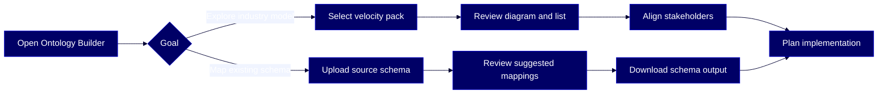

# HOWTO: Explore and map data models with Reltio Ontology Builder

This guide shows you how to use Reltio Ontology Builder to review industry velocity packs and map your existing source schemas to the Reltio data model — no tenant required.

## Overview

Reltio Ontology Builder is a free, public tool on the Reltio website that helps you explore industry [velocity packs](#glossary) and translate existing data schemas into a [canonical model](#glossary) aligned with Reltio — before you have a tenant or begin implementation. It uses AI to analyze uploaded schemas and suggest mappings to Reltio model components.

This guide is for these Reltio roles: **Business User**, **Data Product Owner**, **Solution Architect**. For more information on data unification roles in the Reltio Context Intelligence Platform, see [About roles](https://docs.reltio.com/en/roles/about-roles?utm_source=ai-corpus&utm_medium=markdown&utm_campaign=reltio-ai-ready-docs).

## Contents

1. [Getting started](#1-getting-started)
2. [Key concepts](#2-key-concepts)
3. [Review a velocity pack](#3-review-a-velocity-pack)
4. [Upload and map a source schema](#4-upload-and-map-a-source-schema)
5. [Download and use the schema output](#5-download-and-use-the-schema-output)
6. [Further reading](#6-further-reading)
7. [Glossary](#7-glossary)

## 1. Getting started

Reltio Ontology Builder requires no account, no login, and no Reltio tenant. You just need:

- A modern web browser
- Access to [reltio.com/ontology-builder](https://www.reltio.com/ontology-builder/)
- (Optional, for schema mapping) A source schema file in `XML`, `XSD`, or `JSON` format, 30 MB or smaller, sanitized of confidential or production-sensitive data

> **Important:** Do not upload schemas containing regulated, confidential, or production-sensitive data unless your organization's data handling policies explicitly permit it.

> **Learn more:** [Reltio Ontology Builder](https://docs.reltio.com/en/objectives/model-data/reltio-ontology-builder?utm_source=ai-corpus&utm_medium=markdown&utm_campaign=reltio-ai-ready-docs) in the Reltio documentation.

## 2. Key concepts

Understanding these ideas helps you get the most out of Ontology Builder before you start clicking.

**Two tasks, one tool**

Ontology Builder supports two distinct use cases:

- **Velocity pack exploration** — browse Reltio's prebuilt industry models (B2B, Healthcare, Life Sciences, and more) to understand how Reltio represents entities, relationships, attributes, and model logic for your domain
- **Source schema mapping** — upload a schema from your existing MDM platform or custom system and let the AI suggest how each element maps to the Reltio data model

**What the tool shows you**

Whether you're exploring a velocity pack or reviewing a mapped schema, Ontology Builder always gives you two views:

- **Diagram view** — a graph showing how entity types, relationship types, interaction types, and reference data connect
- **List view** — a tabular breakdown of the same model elements, organized by type

Selecting any node or list item opens a **detail panel** showing:

- **Attributes** and **derived attributes** for the selected element
- **Match**, **Survivorship**, **Cleansers**, and **Validation** logic

**What the tool does not do**

Ontology Builder is a planning and exploration tool. The output it generates — including downloaded schema artifacts — must be reviewed and validated by your team before it's used in actual tenant configuration. It does not configure a Reltio tenant directly.

> **Learn more:** [Reltio Ontology Builder](https://docs.reltio.com/en/objectives/model-data/reltio-ontology-builder?utm_source=ai-corpus&utm_medium=markdown&utm_campaign=reltio-ai-ready-docs) in the Reltio documentation.

## 3. Review a velocity pack

Use this task to explore how Reltio models data for your industry before any implementation work begins. You don't need a schema file for this.

1. Open **Reltio Ontology Builder** at [reltio.com/ontology-builder](https://www.reltio.com/ontology-builder/).
2. If the welcome window appears, select **Start Exploring**.
3. In the top-left corner, open the model selector.
4. Select one of the available velocity packs:
   - **B2B**
   - **B2C**
   - **FinServ**
   - **Healthcare**
   - **Insurance**
   - **LifeSciences**
5. Select **List** to review the velocity pack in a tabular view.
6. In **List** view, browse the following sections:
   - **ENTITY TYPE**
   - **RELATIONSHIP TYPE**
   - **INTERACTION TYPE**
   - **REFERENCE DATA**
   - **SOURCES**
7. Select any model element — an entity type, relationship type, interaction type, or reference data item — to open its detail panel.
8. In the detail panel, select **Attributes** to review the attributes defined for that element.
9. Select **Derived attributes** to review derived attributes, if available.
10. Select the model logic tab to review **Match**, **Survivorship**, **Cleansers**, and **Validation** rules for the selected element.
11. Select **Diagram** to switch to graph view and see how model components connect visually.
12. Use the **Filter**, **LAYOUT**, and **EDGES** controls to adjust the graph view as needed.
13. Select any node in the graph to inspect its details in the detail panel.

After reviewing, identify the model elements that match your implementation goals. Use the selected velocity pack as a starting point for model design discussions with your architecture, governance, or implementation team.

> **Learn more:** [Review a velocity pack in Reltio Ontology Builder](https://docs.reltio.com/en/objectives/model-data/reltio-ontology-builder/review-a-velocity-pack-in-reltio-ontology-builder?utm_source=ai-corpus&utm_medium=markdown&utm_campaign=reltio-ai-ready-docs) in the Reltio documentation.

## 4. Upload and map a source schema

Use this task when you have an existing schema from a legacy MDM platform, source application, or custom data model, and want to see how it aligns with the Reltio data model.

Before you start, confirm your source schema file meets these requirements:

- Format: `XML`, `XSD`, or `JSON`
- Size: 30 MB or smaller
- Content: sanitized — no confidential, regulated, or production-sensitive data

1. Open **Reltio Ontology Builder** at [reltio.com/ontology-builder](https://www.reltio.com/ontology-builder/).
2. In the welcome window, select **Upload Schema**.
3. In the **Upload your schema** window, add your file using one of these options:
   - Drag and drop the file into the upload area
   - Select **Select File** and choose the file from your system
4. Wait while Reltio Ontology Builder analyzes and maps the schema. This may take a moment depending on the schema size.
5. Review the mapped model in **Diagram** view to see how source schema elements connect to Reltio model components — entities, relationships, interactions, and reference data.
6. Select **List** to review mapping results in tabular form.
7. In **List** view, review the following sections:
   - **ENTITY TYPE**
   - **RELATIONSHIP TYPE**
   - **INTERACTION TYPE**
   - **REFERENCE DATA**
   - **SOURCES**
8. For each section, review these columns to understand how your schema aligns with Reltio:
   - **SOURCE SCHEMA** — the element from your uploaded file
   - **RELTIO** — the suggested Reltio model component
   - **MATCH** — the AI confidence level for the suggested mapping
   - **ATTRIBUTES** — the attribute-level alignment
9. Select any mapped Reltio model element to open the detail panel.
10. In the detail panel, review the mapped attributes, derived attributes, and match confidence values for the selected element.

> **Note:** Suggested mappings are AI-generated starting points, not final configurations. Review them carefully with your data architecture or governance team before using them in implementation planning.

> **Learn more:** [Upload a source schema in Reltio Ontology Builder](https://docs.reltio.com/en/objectives/model-data/reltio-ontology-builder/upload-a-source-schema-in-reltio-ontology-builder?utm_source=ai-corpus&utm_medium=markdown&utm_campaign=reltio-ai-ready-docs) in the Reltio documentation.

## 5. Download and use the schema output

After reviewing the suggested mappings, you can download the generated schema output for use in planning and stakeholder discussions.

1. From the mapped model view, select **Download Schema**.
2. Review the downloaded artifact with your data architecture, governance, or implementation team.
3. Validate the generated model before using it as part of tenant configuration or implementation planning.

The downloadable output can include:

- A visual representation of the mapped model
- A mapping summary between source schema components and Reltio model components
- A downloadable schema artifact

> **Important:** Always validate generated model artifacts before using them as part of tenant configuration. Ontology Builder output is a planning aid, not a ready-to-deploy configuration.

> **Learn more:** [Upload a source schema in Reltio Ontology Builder](https://docs.reltio.com/en/objectives/model-data/reltio-ontology-builder/upload-a-source-schema-in-reltio-ontology-builder?utm_source=ai-corpus&utm_medium=markdown&utm_campaign=reltio-ai-ready-docs) in the Reltio documentation.

## 6. Further reading

- [Reltio Ontology Builder](https://docs.reltio.com/en/objectives/model-data/reltio-ontology-builder?utm_source=ai-corpus&utm_medium=markdown&utm_campaign=reltio-ai-ready-docs)
- [Upload a source schema in Reltio Ontology Builder](https://docs.reltio.com/en/objectives/model-data/reltio-ontology-builder/upload-a-source-schema-in-reltio-ontology-builder?utm_source=ai-corpus&utm_medium=markdown&utm_campaign=reltio-ai-ready-docs)
- [Review a velocity pack in Reltio Ontology Builder](https://docs.reltio.com/en/objectives/model-data/reltio-ontology-builder/review-a-velocity-pack-in-reltio-ontology-builder?utm_source=ai-corpus&utm_medium=markdown&utm_campaign=reltio-ai-ready-docs)

## 7. Glossary

**Canonical model:** The standardized data model used by the Reltio Context Intelligence Platform to represent entities, relationships, attributes, and interactions across industries. Ontology Builder helps you map existing schemas to this model.

**Derived attribute:** An attribute whose value is calculated from other attributes rather than loaded directly from a source system. Derived attributes are visible in the detail panel when reviewing a model element.

**Diagram view:** A graph-based visual representation of the selected model, showing how entity types, relationship types, interaction types, and reference data connect to each other.

**List view:** A tabular view of the selected model or mapping results, organized by type (entity type, relationship type, interaction type, reference data, sources).

**Source schema:** A data model definition file exported from a legacy MDM platform, source application, or custom system. Reltio Ontology Builder accepts source schemas in `XML`, `XSD`, or `JSON` format (30 MB max).

**Velocity pack:** A prebuilt, industry-specific Reltio data model that includes entity types, relationship types, interaction types, reference data, attributes, match rules, and survivorship logic for a given domain (B2B, B2C, Healthcare, Life Sciences, and others).

---

> **Disclaimer:** AI-generated from the Reltio documentation snapshot 2026-05-11 02:14 UTC (3,285 topics). AI output can contain subtle inaccuracies, and the knowledge base syncs twice a week — so the content here may lag [docs.reltio.com](https://docs.reltio.com). Verify anything critical against the official docs and your own tenant. Full disclaimer: [DISCLAIMER.md](../DISCLAIMER.md).
